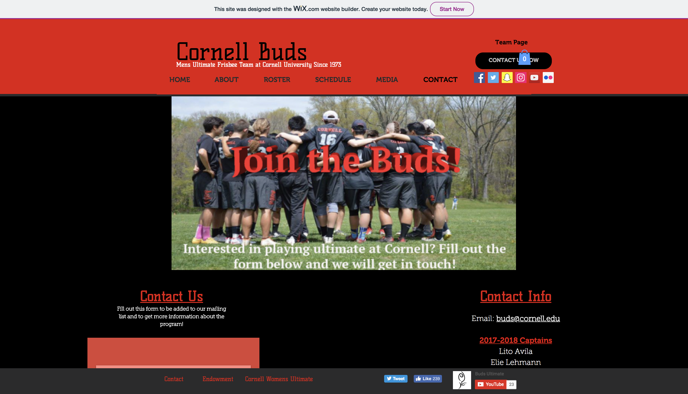
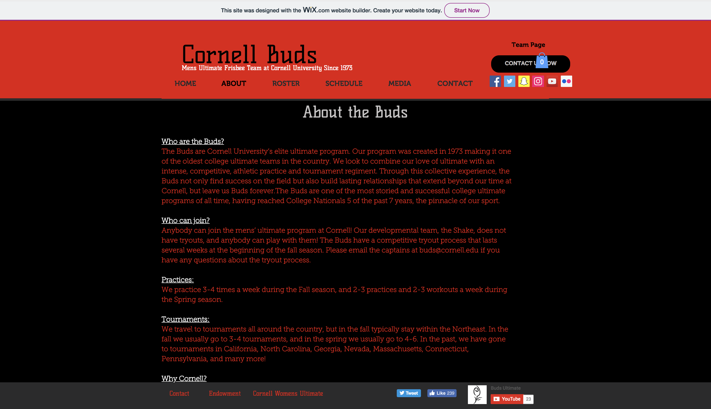
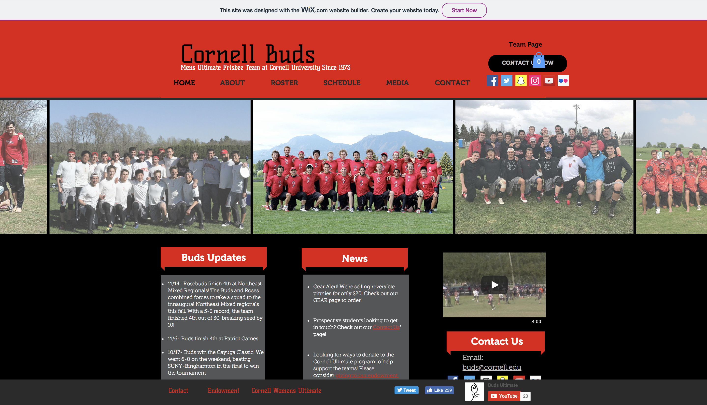
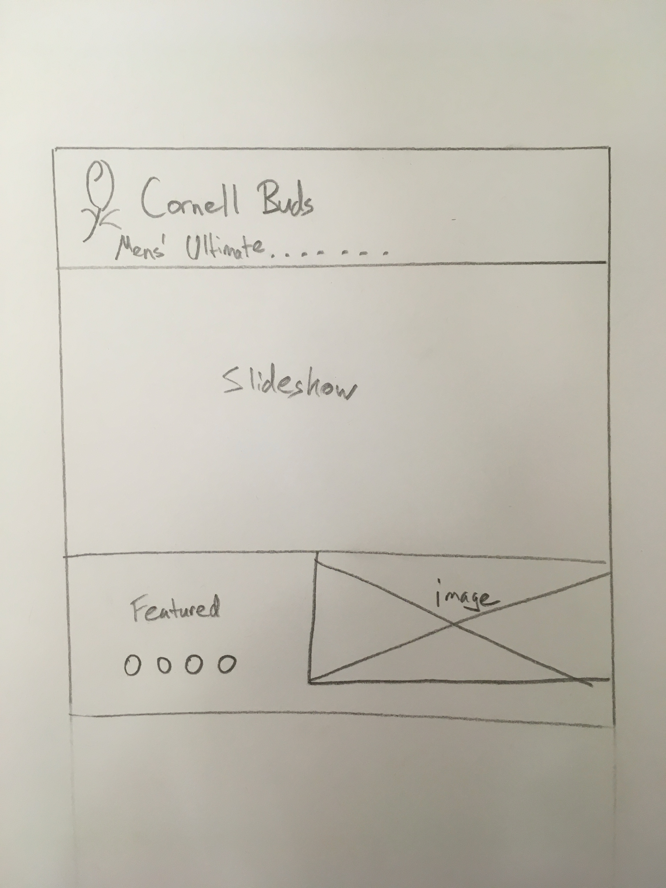
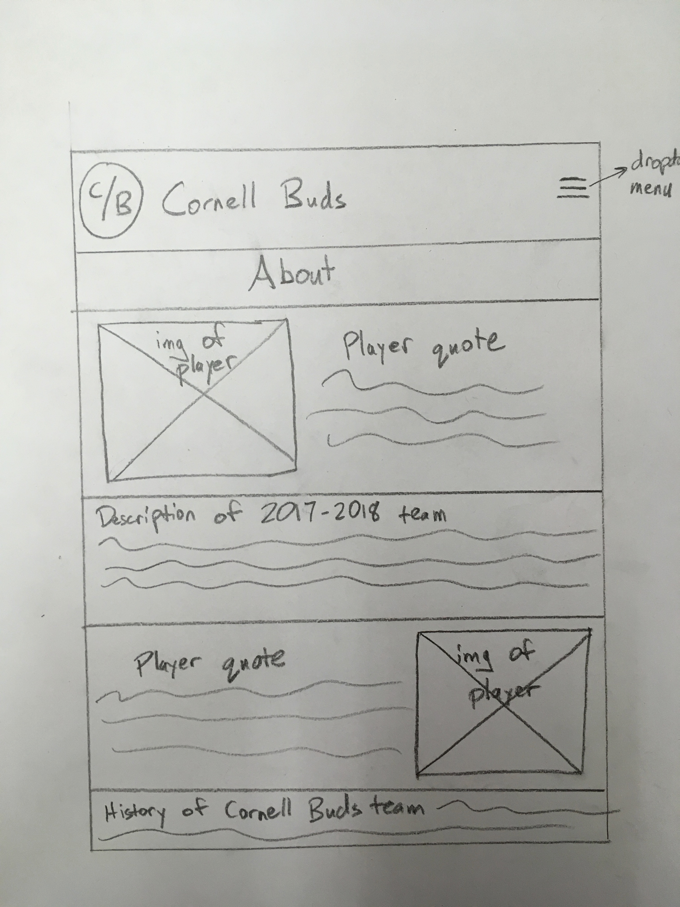
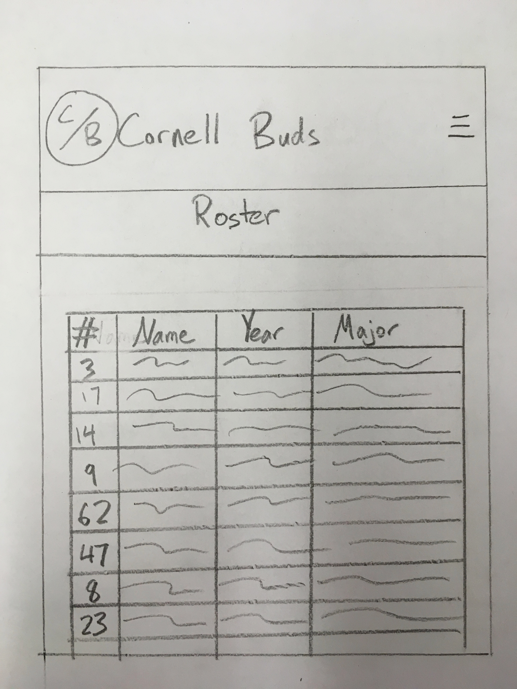
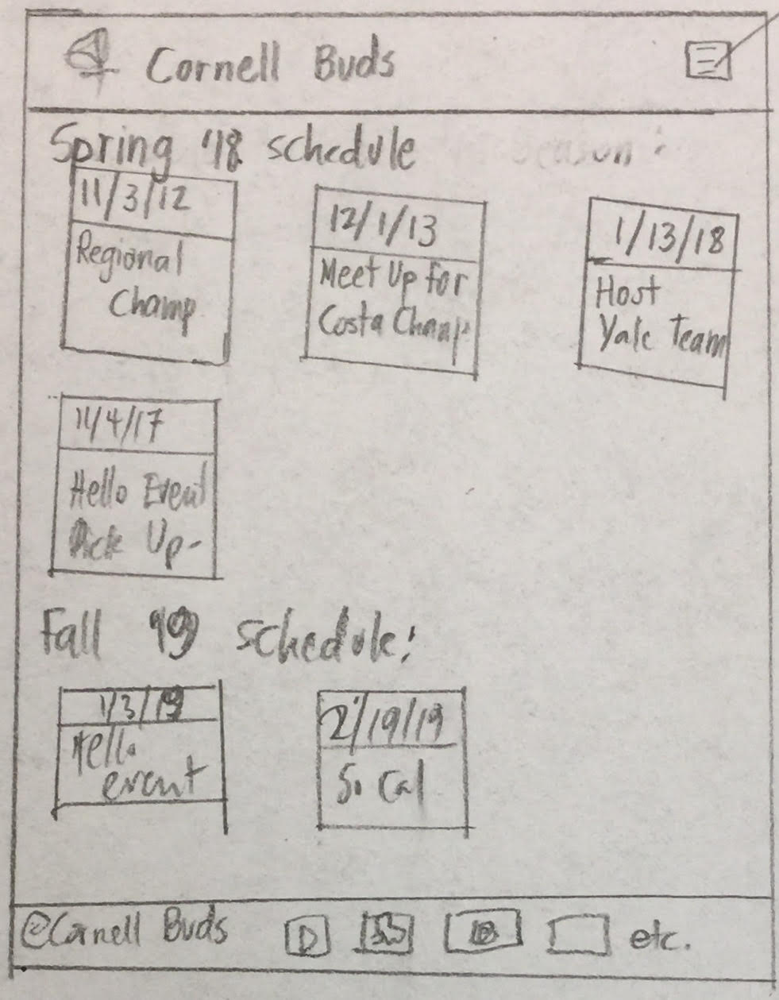
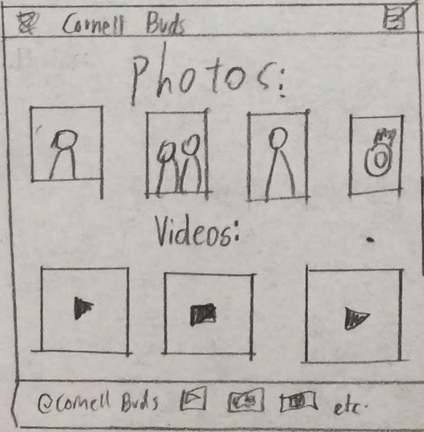
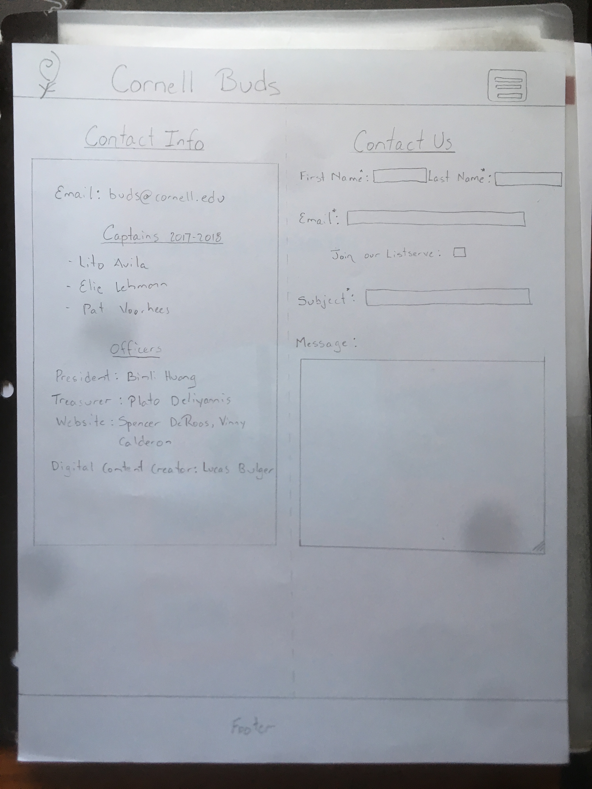

websitetargetDesign-plan:
# Project 4 - Design & Plan

Your Team Name: White Eagle

## Milestone 1, Part II: Client Selection

### Client Description

Cornell Ultimate Frisbee club. It is a student sports club, with their main objective from the website being a place to introduce prospective students and parents about their organization and give current members current information about con-current events and a means to edit the website without having to edit the codebase directly. Also, the website should be an outlet for alumni and sponsors could donate for club expenses.

Current URL: https://www.budsultimate.com/
* Re-design the UI of the website. Currently, it is quite busy with lots of text boxes while we would like to keep it minimalistic in nature and keeping just the bare bones essentials. Also keeping the webpage easy to read using design principles stressed in class.
* Integrate log-in / log-out functionality, Allowing users of the team to be able to edit the webpage directly as well as give them additional access to view important information that the team would like to keep private form the public (scheduling information, rankings, etc.)
* Adding more photos and media in a more clean and organized means.
* Create a contact us form natively, not using Google services
* Design our own website from scratch and not use the Wix platform
* Indicate to the user what webpage they are currently on

## Milestone 1, Part III: Client Requirements

### Target Audience(s)

The potential audience for this site includes a few different types of users. One obvious user is students interested in joining the Ultimate team; they should be able to find out about the recruitment process, about important meetings and events, and to get a sense of what being on the team will be like. Another user group is alumni and parents who want to see how the team is doing, what its accomplishments are, and to see photos and/or video of the team in action. Another user group is current members of the team who want to check on the team schedule or to read about the history of the team.

### Purpose & Content

The purpose of the site is a) to advertise the team, giving a sense of what membership is like and inviting the user to reach out if they are considering joining; b) to inform the user about the team, its record, its members, and its history; and c) to create a media record of the team’s performance with photos and/or videos.

### Needs and Wants

[Collect your client's and target audience's needs and wants for the website. Come up with several appropriate design ideas on how those needs may be met. In the **Memo** field, justify your ideas and add any additional comments you have. There is no specific number of needs required for this, but you need enough to do the job.]

Example:
* Needs/Wants #1
  * **Needs and Wants** (What does your client and audience need and want?)
  * Client wants to be able to upload photos of recent competitions, events, etc.
  * **Design Ideas and Choices** (How will you meet those needs and wants?)
  * For their needs to have a portal to upload their latest photos, we will have a log-in system only for team members, so that they can upload pictures.

  * **Memo** (Justify your decisions; additional notes.)
    * A log-in system allows only members of the team to upload relevant photos, so random users can't spam the site with other content

* Needs/Wants #2
      * **Needs and Wants** (What does your client and audience need and want?)
      * Maintain a calendar of upcoming competitions and events, and a roster of current players
      * **Design Ideas and Choices** (How will you meet those needs and wants?)
        * Create a calendar that is accessible for update only by team members with log-in information, and a roster with the same criteria
      * **Memo** (Justify your decisions; additional notes.)
        * Similar to the photo uploads, this allows team members to update their site without exposing it to random users

* Needs/Wants #3
    * **Needs and Wants** (What does your client and audience need and want?)
    * Provide a description and history of the team, and links to other media sources about the team
    * **Design Ideas and Choices** (How will you meet those needs and wants?)
    * Have an "About" page that talks about the team's story, with links to Twitter/Instagram etc
    * **Memo** (Justify your decisions; additional notes.)
    * Allows users to learn more about the team, and to link to other media where they can continue to explore

* Needs/Wants #4
    * **Needs and Wants** (What does your client and audience need and want?)
    * Provide contact info for possible team members
    * **Design Ideas and Choices** (How will you meet those needs and wants?  
    * Have a "contact" page where users can get in touch with team members to learn more    
    **Memo** (Justify your decisions; additional notes.)
    * Allows users to contact the team if they are interested in joining
### Hosting Plan

[What is your plan for hosting your client's website?]

### Client's Edits

[Does the client need the ability to edit the site after the end of the semester? If **Yes**, tell us how you site fit your client's need. If **No**, write down N/A.]

**Yes** Captains will have the ability to upload new photos, and to add and remove from the roster.

### Information Architecture, Content, and Navigation

[Lay out the plan for how you'll organize the site and which content will go where. Note any content (e.g., text, image) that you need to make/get from the client.]

[Note: As with the Needs and Wants table, there is no specific amount to write here. You simply need enough content to do the job.]

Example:
* Content #1
  * **Main Navigation** (List your site's navigation here.)
    * Portfolio
  * **Sub-Categories** (List any sub-categories of under the main navigation.)
    * Websites
    * Mobile Apps
    * Tablets
  * **Content** (List all the content corresponding to main navigation and sub-categories.)
    * *Portfolio*: list all the projects (as images) this client has worked on. When the image is hovered over, display a description of the project; add a search function to enable users search for specific projects;
    * *Websites*: showcase all the websites designed by the client, with thumbnail images and a brief description for each design;
    * *Mobile Apps*: showcase all the mobile apps designed by the client, with thumbnail images and a brief description for each design;
    * *Tablets*: showcase all the tablet applications designed by the client, with thumbnail images and a brief description for each design;

### Interactivity

[What interactive features will your site have? What PHP elements will you include?]
Our sites interactivity will include a login/ logout option, slideshow, roster, sign up form, news article, schedule, search bar, and a photo gallery.

[Much of this is up to you, however, implementing a login system is **required**. Logging in should not be required to view the site, however it must unlock extra functionality, e.g., admin functionality, comment posting, etc.]

[Also, describe how the interactivity connects with the needs of the clients/target audience.]

The Cornell Buds website needs all these interactive features to promote their team to potential members, post content from past events, and inform current members of upcoming activities. A student interested in joining this team will want to learn more about the program before signing up. The slideshow will appeal to them with special moments and highlights from the past year. Also to dive deeper into the teams overall impression, the user will gain access to some current news articles, roster information, and photos. If at this point, the user is considering joining the team, there is a quick survey asking for contact information and any relevant Ultimate Frisbee questions. This gives them the opportunity to reach out the team and comment anything they need. Many of these features will be very useful to the current members of the team as well. Teammates can relive moments with each other by using reading the articles and photos. The login function allows them to add content of there own and also comment on existing photos. Also, if any of their stats change they can update it on the roster page. All the features we are planning to use on our website will be in the target audience best interest and ultimately lead to the best user experience.
### External Code

[What libraries (e.g. editor.js, jQuery Cookie, Image Sliders, jQuery) are you planning to use for the site? What do you have to do to incorporate those libraries? How much of your own code will satisfy the project requirements?]

### Scale

[How large will the site be (approximate number of pages) and how many hours of work will be required to complete it?]
Currently we think 6 visible pages will be necessary to provide all the content and user ability to our target audience, plus the login/logout pages. At around 7 pages and 4 hours of work per page, we estimate 28 hours of work: but we think it will take more time than this, to include for troubleshooting, merges, and creating and modifying the database.

## Milestone 1, Part III: Client Requirements

### Target Audience(s)

The potential audience for this site includes a few different types of users. One obvious user is students interested in joining the Ultimate team; they should be able to find out about the recruitment process, about important meetings and events, and to get a sense of what being on the team will be like. Another user group is alumni and parents who want to see how the team is doing, what its accomplishments are, and to see photos and/or video of the team in action. Another user group is current members of the team who want to check on the team schedule or to read about the history of the team.

### Purpose & Content

The purpose of the site is a) to advertise the team, giving a sense of what membership is like and inviting the user to reach out if they are considering joining; b) to inform the user about the team, its record, its members, and its history; and c) to create a media record of the team’s performance with photos and/or videos.

### Needs and Wants

[Collect your client's and target audience's needs and wants for the website. Come up with several appropriate design ideas on how those needs may be met. In the **Memo** field, justify your ideas and add any additional comments you have. There is no specific number of needs required for this, but you need enough to do the job.]

**Needs and Wants** (What does your client and audience need and want?)

* Upload photos of recent competitions, events, etc.
* Maintain a calendar of upcoming competitions and events
* Maintain a roster of current players
* Provide a description and history of the team
* Provide links to other media sources about the team
* Provide contact info for possible team members

**Design Ideas and Choices (How will you meet those needs and wants?)**

* For their needs to have a portal to upload their latest photos, we will have a log-in system only for team members, so that they can upload pictures.
* We are also thinking about making a shopping page to sell gears
* A webpage for news is also needed. Building upon this page, logged in users will have access to upload a new post
* A slide show on homepage seems like a good idea. And we will manage to give club members the access to add images to that slideshow.

### Hosting Plan

[What is your plan for hosting your client's website?]

They are have a current website, so when we are done, they probably will just host the new version of website with the same server.

### Client's Edits

Yes, the client would like to make changes to the website after the end of the semester. There can be certain accounts associated with the team that gives them special access to change the website. Furthermore, we we give them the actual files of the website, and have everything connected via the database so they can make easy changes.

### Information Architecture, Content, and Navigation

Content by Navigation:
	  Navigation pages: Home, About, Roster, Schedule, Media, Contact
    Home: Slideshow, pictures of team, can acquire from their current website’s photos
    About: News, History, Past seasons, Gear, (donate); can acquire all this info from the current website. News will need to be updated periodically (perhaps something the captains do. The donate functionality may not be possible at our current level.
    Roster: the current roster of the team. Can get from current website. Will simply be the depiction of the roster table of our database.
    Schedule: the current season schedule and the upcoming season schedule. Will need to be updated by a captain but we can get the info from the current website.
    Media: pictures and videos of the team at different tournaments and practices. We can get pictures from the website, but they may be out of date. Captains should be able to update this section as needed.
    Contact: a form to contact the team directly. Will need the team’s email to do this and other information.

### Interactivity

Logged-in system is implemented on this website for certain users. Since we are making a website for a club, club members are supposed to have certain privileges on this website comparing to other users. For example, when club members are logged in, they can post pictures on their website.

A contact form is also expected on this website for any users to submit. By submitting this form, they can say whatever they want to say to this club. And they also have options of whether being added to the email list.

Another form is necessary for ordering gears. Because this club has designed its own shirts and hoodie, it expects us to incorporate an order form into our website. However, to even further improve that, we can make a real shopping page that they can sort of check out.

### External Code

It is likely that we will use jQuery to program movement and interactivity on the website without having it reload. For example, there will most likely be a slideshow with pictures of the team on some page. This will require jQuery on its own. We expect our own code to satisfy most if not all the project requirements. JQuery will most likely be used for aesthetic purposes.

**library**

We probably will use jQuery to make a slideshow on our home page. However, the use of jQuery is not so necessary because there is more than one way to make a slideshow.

### Scale

To fit all the requirements of the project and our client, the website will most likely be around 10-11 pages. We expect this to take approximately 150 hours to complete between the 5 of us. Including log-in, log-out, shopping, and check-out page, this website will have 12-15 pages in total.

## Milestone 1, Part IV: Work Distribution

For this milestone, we assigned tasks based on amount of questions we need to answer. However, situation will vary in the future. But in general, we will distribute tasks based on estimated time consumption. As we have done several projects, we all should have capabilities to estimate how much time we need to finish certain amount of work.

Our inner milestone is also depending the actual milestone. We decided to set our inner milestone to be one or two days before the actual milestone dues. Therefore, we can have a chance to catch some last-minute mistakes. Or if anyone member has problem that he cannot solve, we can all collaborate.

## Milestone 1, Part V: Additional Comments
None

## Milestone 2, Part I: PHP Interactivity

[Describe here what you plan to do for your PHP Interactivity requirement.]

* Log_in: This function is mainly for team members so that they can update their photos, rosters, and schedules. Moreover, after logged in, team members can update web content.

* photo gallery: once logged in, users(team members) can upload photos and delete them

* Search bar on the roster: this function is designed to allow any user to search team members from roster. Roster will be a table based on a database that has three fields.

* Contact form:
	Users who are interested in this team regarding to whatever aspect could submit a form with user's name, email, and comment. Name,Input_email_address will be added into a serverlist

## Milestone 2, Part II: Sketches, Navigation & Wireframes

### Sketches

### Navigation

We will have a dropdown button on our header, which will be our menu or navigation system.

* index.php
* about.php
* roster.php
* schedule.php
* photos.php
* contact.php

### Wireframes

### Milestone 2, Part III: Evaluate your Design

[Use the GenderMag method to evaluate your wireframes.]

[Pick a persona that you believe will help you address the gender bias within your design.]

I've selected **Abby** as my persona.

I've selected my persona because Abby highlights some of the gendered problems that users can face. In debugging or problem-solving, Abby dislikes tinkering, and has low confidence in her technological abilities. We want to make a site that allows for users like Abby who do not want to have to "tinker" to figure out how to effectively and efficiently use the site. Therefore, we will try to design a site that Abby would be comfortable and confident engaging with.

### Tasks

[You will need to evaluate at least 3 tasks (known as scenarios in the GenderMag literature). List your tasks here. These tasks are the same as the task you learned in INFO/CS 1300.]

[For each task, list the ideal set of actions that you would like your users to take when working towards the task.]

**Task name #1: Read about the 2017-2018 team**

**Subgoal # 1 : Go to the "About" page**

Abby will have formed this sub-goal. Because she prefers to look over the site first and gather information before making a decision, she will evaluate the names of the pages, and will realize that the "About" page is where she will be able to read about the 2017-2018 team.

**Action #1 : Click on the "About" page**
Abby will know what to do at this step, for the above reasons.

**Action #2: Scroll down to find the description**
Abby will know that she needs to scroll down, since her process is gathering information before problem-solving. This means that she will instinctively explore the page before deciding that there is a problem, and this means that she'll find the section she is looking for.

Abby will know that she did the right thing, because she will be taken to the About page, which will display a section that describes the 2017-2018 team, with an appropriate title.

**Task name #2: Buy merchandise**

**Subgoal # 2 : Go to the "Media" page**

Abby will not have formed this sub-goal. The name "Media" is not an obvious page to click on to find possible merchandise; and since she doesn't like to tinker, it might be a while before Abby could find that this is the page she is looking for. Therefore, we should consider renaming the page to something like "Merchandise."

**Action #1 : Click on the "Media" page**
Abby will not know what to do at this step, for the above reasons.

If Abby does end up clicking on the "Media" page, she will know that she's done the right thing, because she will be able to see merchandise displayed immediately on that page.

**Task name #3: Find the contact page**

**Subgoal #1 : Find a way to contact the team**

Abby will have formed this sub-goal. Because she prefers to look over the site first and gather information before making a decision, she will evaluate the names of the pages, and will realize that the "Contact" page is where she will be able to get in touch with the team about possibly joining.

**Action #1 : Click on the "Contact" page**
Abby will know what to do at this step, because she will examine the page names and conclude that "Contact" is the most likely page to have what she is looking for.

She will know that she has done the right thing, because once she clicks on the button she will be taken to the Contact page and see a way to contact the team through a form.

Current URL: https://www.budsultimate.com/

Re-design the UI of the website. Currently, it is quite busy with lots of text boxes while we would like to keep it minimalistic in nature and keeping just the bare bones essentials. Also keeping the webpage easy to read using design principles stressed in class.
Integrate log-in / log-out functionality, Allowing users of the team to be able to edit the webpage directly as well as give them additional access to view important information that the team would like to keep private form the public (scheduling information, rankings, etc.)
Adding more photos and media in a more clean and organized means.
Create a contact us form natively, not using Google services
Design our own website from scratch and not use the Wix platform

### Milestone 2, Part IV: Plan Your database

** Init.sql:
  * “Accounts”
    id - Int NN PK AI U
    Username- Text NN U
    Password- Text NN
    Session - Text U

  * "contact"
    id - INT NN PK AI U
    first_name - TEXT NN
    last_name- TEXT NN
    email- TEXT NN U
    listserv- INT
    subject- TEXT NN
    message- Text

  * "photos"
    id- INT NN PK AI U
    photo_name- TEXT NN
    photo_ext- TEXT NN
    uploader_id- INT NN

### Milestone 2, Part V: Structure and Pseudocode
* Schedule.php:
Each event card will saved in an associative array with event’s date as well as the name of the event. These cards will be displayed using CSS and HTML onto the webpage. If we have time, we will put the event information onto a SQL table and have that information editable by admin accounts. Since we already have a lot of PHP components and our clients are extremely interested in adding this functionality, we will hold off to do this part until we finish the more pressing and urgent improvements.

* Init.php (only login/logout functionality):
Implement 3 main functions
check_login(){
If a session is created, exec_sql_query(). If it works, return the username }

* log_in(username, password){
If username and password are used, exec_sql_query(). Verify password. Set cookie.return login message }

* log_out(){
If there is a current user, set the session to null and exec_sql_query(). Remove the cookie and set the current user to null}

* Sanitize input
If the user attempts to login, filter_input both the username and password

* index.php
slide_show(){
Create an array with the paths of all images that should be included in this slide_show
Set up each image inside of this array by indexing each one in order
And set backgroundImage to a variable that will be assigned with the index of each image
Then setInterval() will help to set a timecourse between each slide
}

* contact.php
  Form: All inputs except message need to be filtered using FILTER_SANITIZE_STRING, FILTER_VALIDATE_EMAIL and trim function in order to be prepared for storage in database. No email-sending functionality. Once submit button has been clicked will redirect user to a confirmation page that their message was sent if successful submission. successful submission, inputs will be stored in DB. If The message page will pull the first name, last name, email, and email subject and display those inputs to the user.

  SQL query: INSERT INTO contact (first_name, last_name, email, listserv, subject, message) VALUES (:firstname, :lastname, :email, :listserve, :subject, :message);

* messages.php
  Page available only to certain users for purposes of viewing messages. Will be a simple page that will display contents of contact table. Php code would consist of a sql query stored into a variable as array, then looping through each array in the associative array and displaying each cell in a formatted manner onto the page. The output needs to be escaped but should already be from the contact page.

  SQL query: SELECT * FROM contact;

  * photos.php
  Php code must first retrieve data from photos table in database. This will set an associative array that could loop through the data and display each picture in a grid-like manner. The loop would need grab the id and extension and concatenate the path together that will be the pointer to which photos in the table to display. The code will also keep track of whether the user is logged in or not and who the current user is. The uploads option will not be visible to the user unless they are logged in (using if current_user or if session or similar). If logged in, this functionality will be visible and available.
  For uploading, code must pull the name and extension of the input to store in the database, then move that upload to the uploads folder for access by the rest of the code. Certain (?) users will also have access to delete the image from the website and the database. This functionality will only appear if logged in.

  SQL queries:
  INSERT INTO photos (image_name, image_ext, uploader_id) VALUES (:image_name, :image_ext, :uploader_id);
  DELETE FROM photos (all fields) WHERE (inputs based on selection);
  SELECT * FROM photos;

### Final Milestone: Cognitive Walkthrough

**Task #1: Navigate from Home page**

**Subgoal #1: Find the navigation menu**

  - Will Abby have formed this sub-goal as a step to their overall goal?
    - Yes
    - Abby should have formed this sub-goal if she wishes to navigate off of the Home page. While Abby has relatively low experience with computers, she mostly struggles with "low confidence about doing unfamiliar computing tasks." Finding a navigation menu on a website is one of the most basic tasks there is in exploring the Internet, so Abby should have formed this sub-goal. However, the question then is how well our site facilitates her search.

**Action #1: Click on the drop-down menu and then click on the desired page to go to**

  - Will Abby know what to do at this step?
    - Maybe
    - Abby will probably recognize our three-line drop-down menu design, since it is fairly standard and she will probably have seen it before — it shouldn't fit in the "unfamiliar computing tasks category" where she struggles. However, it's not as clear as it could be that this menu is connected to the page that one is on. Because of this, we have decided to put the name of the current page under the menu, to signal more clearly that this drop-down menu is connected to page navigation.

  - If Abby does the right thing, will she know that she did the right thing, and is making progress towards her goal?
    - Yes
    - Once, she clicks on it, Abby will recognize the drop-down menu as the way to navigate to another page, since it lists the names of all the other pages. Again, because Abby struggles with unfamiliar computing tasks, once she is able to see the drop-down menu list she will know what to do, because a menu for page navigation is something she will be familiar with.

**Task #2: Send a message or question to the team captains**

**Subgoal #1: Go to the "Contact" page**

- Will Abby have formed this sub-goal as a step to their overall goal?
  - Yes
Abby should have formed this sub-goal. Abby prefers to gather information before acting on it, so she will probably examine the site to gather information — for example, exploring the navigation menu and looking at all of the options - before she acts. When Abby reads the names of the pages, she will realize that the "Contact" page is where she will be able to get in touch with the team.

**Action #1: Click on the "Contact" page**
- Will Abby know what to do at this step?
  - Yes
Abby should know what to do at this step; because of the reasons listed in the previous Task, she will know to go to the navigation menu in the top right; and because of the reasons listed in the subgoal above, she will have figured out that she needs to go to the Contact page. All that is left is for her to click on the "Contact" button in the menu.
- If Abby does the right thing, will she know that she did the right thing, and is making progress towards her goal?
  - Yes. She will be taken to the contact page, and see the form for contacting the team.

**Action #2: Fill out the contact form**
- Will Abby know what to do at this step?
  - Yes
Abby should know what to do at this step. Because she likes to gather information before acting, first she will read through the form, so she will have an understanding of what information she should put where before she actually fills it out.
- If Abby does the right thing, will she know that she did the right thing, and is making progress towards her goal?
  - Yes. She will be able to see that the form is being filled out with the information she is inputting.

  **Action #3: Click "Send"**
  - Will Abby know what to do at this step?
    - Yes
  Abby should know what to do at this step. Abby will be familiar with the function of a "submit" or "send" button, and since our button is named "send" to intuitively make sense to somebody looking to send information to the team, she will know what to do.
  - If Abby does the right thing, will she know that she did the right thing, and is making progress towards her goal?
    - Yes. She will be taken to a "message-submitted" page that will thank her, and tell her that she will be contacted soon!

**Task #3: Learn about the team, and how to join**

**Subgoal #1: Find a page with information about the team's practices and recruitment**
- Will Abby have formed this sub-goal as a step to their overall goal?
  - Yes
Abby should have formed this sub-goal. Abby will note that the Home page does not have this information, so she will know that she needs to find this information on another page. Since she prefers to begin by gathering information, Abby will look at the names of the pages, and conclude that "About" is where she will learn more details about the team.

**Action #1: Click on the "About" page**
- Will Abby know what to do at this step?
  - Yes
Abby should know what to do at this step; because of the reasons listed in the previous Task, she will know to go to the navigation menu in the top right; and because of the reasons listed in the subgoal above, she will have figured out that she needs to go to the About page. All that is left is for her to click on the "About" button in the menu.
- If Abby does the right thing, will she know that she did the right thing, and is making progress towards her goal?
  - Yes. She will be taken to the About page, and see the information she is looking for. However, she must scroll down to find it, since "History" is what is listed at the top. Because it is least likely that somebody will be searching for the history of the team rather than information about joining the team and what their practice schedule is like, we have decided to move around the order of the sections, so that information about how to join is listed at the top, then information about the practice schedule, and finally the info about the team's history at the bottom.

### Milestone 5, Thoughtful and Complete Notes to Client

    Hello Cornell Buds,

    We have created a website that we feel matches all of the Cornell Bud's needs. Firstly, we have worked to make the website as clean as possible, making it easy to navigate and keeping the essentials. We worked hard to understand whom the target audience of the website is and designing for these individuals. We included a lot of photos throughout the website, hoping to fulfill the wants of many of the parents and team members looking onto the site. This also goes towards the buds goal of creating a website that is clean and easy to understand. Everyone can understand pictures instantly and they say a lot about the team without the usage of words. We also have included text in as meaningful a way as possible, hoping to further make the website easy to understand and navigate. This is further exemplified by the website's means of navigation bar. Rather than using a traditional header layout, we used a hamburger drop-down. A very clean futuristic feature we know the team will love. We also integrated log-in and log-out functionality, which allows the team members and captains to edit the information on the website. This makes it really easy for future generations to use the website and maintain the information provided - a problem that many clubs often face. There are also a contact-us form integrated into the website natively without the usage of Google API. This makes the website get a more professional feeling. While designing the website, we also took graphic design very seriously. We felt that having red boxes with a paper-esk background was perfect because the red reflected the bold-cutting edge Buds team while the paper background is a solid nod to the team's past. This choice is one that we really appreciate and know the team will as well. We also have an element that tells the user what webpage they are currently on, an element that makes the user-experience even better and helps the target audience fulfill achieve their tasks on the website. Overall, we are certain that you will love the website as much as we do, taking a massive step from the current Wix hosted website the team is currently using. Lastly, all of the editable information is backed by a database which allows the website to be editable for the future, making it truly future proof.

    If the team would like to edit usernames and passwords in the future, they can do so through the init.sql file. Everything else, including editing the schedule, pictures and contact form information can all be done through editing the website directly. A feature that is truly incredible for keeping the teams website future proof. These are all features the website did not have before, and will received well by the rest of the team.

    If the team has any questions regarding the website, they are more than welcome to the design team. We have really grown to love the Buds and the teams rich history and would be more than welcome to help if any issues pop-up in the future.

    Thanks for this great opportunity and Go Big Red!

    From,
    White-Eagle
    CS 2300
